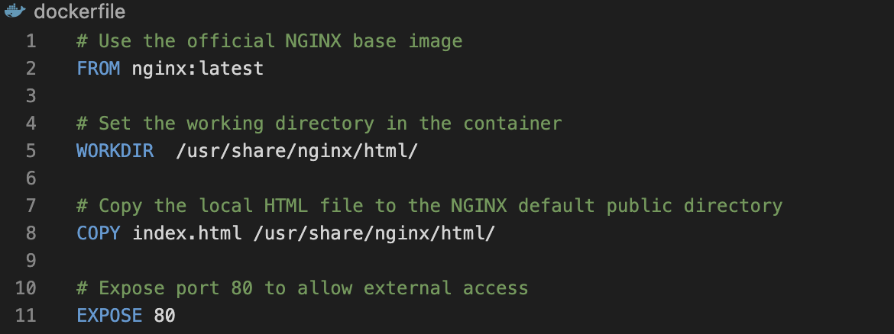

## Jenkins Pipeline Job

### Understanding Jenkins Pipeline Job

A Jenkins pipeline job is a way to define and automate a series of steps in the software delivery process. It allows you to script and orc Jenkins pipelines enable organizations to define, visualize, and execute intricate build, test, and deployment processes as code. This fo integration and continuous delivery (CI/CD) practices into software development. Let's recall our docker foundations project when we created a dockerfile and made a docker image and container with it.

### Creating a Pipeline Job

- From the jenkins dashboard menu on the left side, I clicked on new item.

- Creating a pipeline Job naming it my-pipeline-job.

### Configuring Build Trigger

- Clicking on "Configure" and adding the below configurations

- Clicking on the build trigger to configure triggering the job from github Webhook.

#### Writing Jenkins Pipeline Script 

A jenkins pipeline script refers to a script that defines and orchestrates the steps and stages of a continuous integration and continuos delivery CI/CD pipeline. Jenkins can be defined using either declarative or scripted syntax. Declarative syntax is a more structured and concise way to define pipelines. It uses a domain-specific language to describe the pipeline stages, steps, and other configurations while scripted syntax provides more flexibility and is suitable for complex scripting requirements.

#### See the Pipeline Script written below and the Explanations

#### Explanation of the script above 

The provided Jenkins pipeline script defines a series of stages for a continuous integration and continuous delivery (CI/CD) process. Let's understand each stage. 

- Agent Configuration:

`agent any`

Specifies that the pipeline can run on any available agent (an agent can either be a jenkins master or node). This means the pipeline is not tied to a specific node type.

- Stages

`stages {`

   `// Stages go here`
 `}`

Defines the various stages of the pipeline, each representing a phase in the software delivery process.

- Stage 1: Connect to Github:

`stage('Connect To Github') {`
   `steps {`
      `checkout scmGit(branches: [[name: '*/main']], extensions: [], userRemoteConfigs: [[url: 'hhttps://github.com/bolajidevops/my-pipeline-job.git']])`
   `}`
`}`

This stage checkout the source code from a Github repository (https://github.com/bolajidevops/my-pipeline-job.git)

It also specify that the pipeline should use `main` as the branch.

- Stage 2: Build Docker image:

`stage('Build Docker Image') {`
   `steps {`
      `script {`
         `sh 'docker build -t dockerfile .'`
      `}`
   `}`
`}`

This stage builds a Docker image named 'dockerfile' using the source code obtained from the GitHub repository.

The 'docker build command is executed using the shell (`sh`).

- Stage 3: Run the Container:

`stage('Run Docker Container') {`
   `steps {`
      `script {`
         `sh 'docker run -itd --name nginx -p 8081:80 dockerfile'`
      `}`
   `}`
`}`

This stage runs a Docker container named 'nginx' in detached mode (`'-itd`).

The container is mapped to port 8081 on the host machine (`-p 8081:80`).

The Docker image used is the one built in the previous stage ('dockerfile').

#### The pipeline script is then copied and added to the section in the below image.

The stage 1 of the script connects jenkins to github repository. To generate syntax for your github repository, follow the steps below.

- Click on the pipeline syntax

- Select the drop down to search for 'checkout: Check out from version control`

- Paste you repository url and make sure your branch is main

- Generate Pipeline Script.

#### Building Pipeline Script

Docker and Jenkins are installed on my EC2 instance, a dockerfile needs to be created before i can run my pipeline script. Definitely i cant build a docker image without a dockerfile.

- Creating a new file named 'dockerfile` and the codes in the image below give docker the instructions.

- Creating an `index.html` file and paste the content below.

`Congratulations Bolaji, You have successfully run your first pipeline code.`

- Pushing these files `dockerfile` and `index.html will trigger jenkins to automatically run new build for our pipeline.

To access the content of `index.html on my web browser, I need to first edit inbound rules and open the port mapped on my container to (8081).

The content of the html file can now be accessed on web browser using the url below.

`http://13.53.172.242:8081/`

